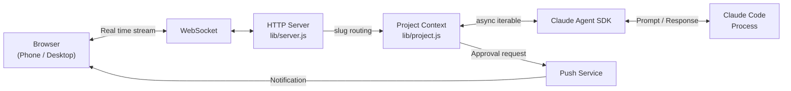

# Clay

<h3 align="center">Claude Code in your browser. Bring your team, or build one.</h3>

[](https://www.npmjs.com/package/clay-server) [](https://www.npmjs.com/package/clay-server) [](https://github.com/chadbyte/clay) [](https://github.com/chadbyte/clay/blob/main/LICENSE)

Everything Claude Code does, Clay does in your browser. Plus multi-session, file browser, scheduled agents, mobile notifications, and more. Invite your team to work together in the same session, or build an AI team from scratch. **Your machine is the server.** No cloud relay, no middleman.

```bash
npx clay-server
# Scan the QR code to connect from any device
```

---

## What you get

### Everything the CLI does

Your CLI sessions, your CLAUDE.md rules, your MCP servers. **All of it works in Clay as-is.** Pick up a CLI session in the browser, or continue a browser session in the CLI. Same SDK, same tools, same results.

<p align="center">
  
</p>

### Everything the CLI doesn't

**Multiple agents, multiple projects, at the same time.** Switch between them in the sidebar. Browse project files live while the agent works, with syntax highlighting for 180+ languages. Mermaid diagrams render as diagrams. Tables render as tables.

**Schedule agents with cron**, or let them run autonomously with **Ralph Loop**. Your phone buzzes when Claude needs approval, finishes a task, or hits an error. Install as a **PWA for push notifications**. Close your laptop, sessions keep running.

<p align="center">
  
</p>

### Bring your whole team

**One API key runs the whole workspace.** Invite teammates, set permissions per person, per project, per session. A designer reports a bug in plain language. A junior dev works with guardrails. If someone gets stuck, **jump into their session** to help in real time.

Add a CLAUDE.md and the AI operates within those rules: explains technical terms simply, escalates risky operations to seniors, summarizes changes in plain words. Real-time presence shows who's where.

### Build your team with Mates

Not *"act like a design expert."* Mates are AI teammates shaped through real conversation, trained with your context, and built to hold their own perspective. Give them a name, avatar, expertise, and working style. **They don't flatter you. They push back.**

They live in your sidebar next to your human teammates. @mention them in any project session when you need their take, DM them directly, or bring multiple into the same conversation. Each Mate builds persistent knowledge over time, remembering past decisions, project context, and how you work together.

#### Debate before you decide

Let your Mates challenge each other. Set up a debate. Pick a moderator and panelists, give them a topic, and let them go. You can raise your hand to interject. When it wraps up, you get opposing perspectives from every angle.

"Should we rewrite this in Rust?" "Should we delay the launch to fix onboarding?" "Should we position this as enterprise-first or PLG?" Get real opposing perspectives before you commit.

### Your machine, your server

Clay runs as a daemon on your machine. **No cloud relay, no intermediary service** between your browser and your code. Data flows directly to the Anthropic API, exactly as it does from the CLI.

PIN authentication, per-project permissions, and HTTPS are built in. For remote access, use a VPN like Tailscale.

---

## How a bug gets fixed

**Without Clay:**
Designer finds a bug → writes up a ticket on Asana → dev asks clarifying questions → PM prioritizes → dev opens terminal, fixes it → shares a preview → QA checks → deploy
<br>*7 steps. 3 people. 2 days.*

**With Clay:**
Designer opens Clay in the browser, describes the bug in plain language → senior joins the same session, reviews the fix together → merge
<br>*2 steps. 2 people. Minutes. The designer never touched a terminal.*

---

## How Clay compares

*As of March 2026.*

| | CLI | Remote Control | Channels | **Clay** |
|---|---|---|---|---|
| Multi-user with roles | – | – | Platform-dependent | **Accounts + RBAC** |
| AI teammates (Mates + Debates) | – | – | – | **Yes** |
| Join teammate's session | – | – | – | **Yes** |
| Persistent daemon | – | Session-based | – | **Yes** |
| Native mobile app | – | **Yes** | **Platform app** | PWA |
| Official support | **Anthropic** | **Anthropic** | **Anthropic** | Community |

Clay is a community project, not affiliated with Anthropic. Official tools receive guaranteed support and updates.

---

## Getting Started

**Requirements:** Node.js 20+, Claude Code CLI (authenticated).

```bash
npx clay-server
```

On first run, it walks you through port and PIN setup.
Scan the QR code to connect from your phone instantly.

For remote access, use a VPN like Tailscale.

<p align="center">
  
</p>

---

## FAQ

**"Is this just a terminal wrapper?"**
No. Clay runs on the Claude Agent SDK. It doesn't wrap terminal output. It communicates directly with the agent through the SDK.

**"Does my code leave my machine?"**
The Clay server runs locally. Files stay local. Only Claude API calls go out, which is the same as using the CLI.

**"Can I continue a CLI session?"**
Yes. Pick up a CLI session in the browser, or continue a browser session in the CLI.

**"Does my existing CLAUDE.md work?"**
Yes. If your project has a CLAUDE.md, it works in Clay as-is.

**"Does each teammate need their own API key?"**
No. Teammates share the Claude Code session logged in on the server. You can also assign different API keys per project for billing isolation.

**"Does it work with MCP servers?"**
Yes. MCP configurations from the CLI carry over as-is.

---

## HTTPS

HTTPS is enabled by default using a builtin wildcard certificate for `*.d.clay.studio`. No setup required. Available from `v2.17.0-beta.2`. Your browser connects to a URL like:

```
https://192-168-1-50.d.clay.studio:2633
```

The domain resolves to your local IP. All traffic stays on your network. See [clay-dns](clay-dns/) for details on how this works.

Push notifications require HTTPS, so they work out of the box with this setup. Install Clay as a PWA on your device to receive them.

<details>
<summary><strong>Alternative: local certificate with mkcert</strong></summary>

If you prefer to use a locally generated certificate (e.g. air-gapped environments where DNS is unavailable):

```bash
brew install mkcert
mkcert -install
npx clay-server --local-cert
```

This generates a self-signed certificate trusted by your machine. The setup wizard will guide you through installing the CA on other devices.

</details>

---

## CLI Options

```bash
npx clay-server              # Default (port 2633)
npx clay-server -p 8080      # Specify port
npx clay-server --yes        # Skip interactive prompts (use defaults)
npx clay-server -y --pin 123456
                              # Non-interactive + PIN (for scripts/CI)
npx clay-server --no-https   # Disable HTTPS
npx clay-server --local-cert # Use local certificate (mkcert) instead of builtin
npx clay-server --no-update  # Skip update check
npx clay-server --debug      # Enable debug panel
npx clay-server --add .      # Add current directory to running daemon
npx clay-server --add /path  # Add project by path
npx clay-server --remove .   # Remove project
npx clay-server --list       # List registered projects
npx clay-server --shutdown   # Stop running daemon
npx clay-server --dangerously-skip-permissions
                              # Bypass all permission prompts (requires PIN at setup)
npx clay-server --dev        # Dev mode (foreground, auto-restart on lib/ changes, port 2635)
```

---

## Architecture

Clay drives Claude Code execution through the [Claude Agent SDK](https://www.npmjs.com/package/@anthropic-ai/claude-agent-sdk) and streams it to the browser over WebSocket.



For detailed sequence diagrams, daemon architecture, and design decisions, see [docs/architecture.md](docs/architecture.md).

---

## Contributors

<a href="https://github.com/chadbyte/clay/graphs/contributors">
  
</a>

## Contributing

Bug fixes and typo corrections are welcome. For feature suggestions, please open an issue first:
[https://github.com/chadbyte/clay/issues](https://github.com/chadbyte/clay/issues)

If you're using Clay, let us know how in Discussions:
[https://github.com/chadbyte/clay/discussions](https://github.com/chadbyte/clay/discussions)

## Disclaimer

This is an independent project and is not affiliated with Anthropic. Claude is a trademark of Anthropic.

Clay is provided "as is" without warranty of any kind. Users are responsible for complying with the terms of service of underlying AI providers (e.g., Anthropic, OpenAI) and all applicable terms of any third-party services. Features such as multi-user mode are experimental and may involve sharing access to API-based services. Before enabling such features, review your provider's usage policies regarding account sharing, acceptable use, and any applicable rate limits or restrictions. The authors assume no liability for misuse or violations arising from the use of this software.

## License

MIT
