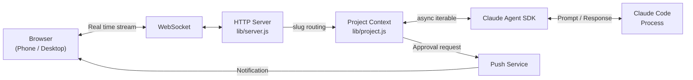

# Clay

<h3 align="center">Claude Code in your browser. Bring your team, or build one.</h3>

[](https://www.npmjs.com/package/clay-server) [](https://www.npmjs.com/package/clay-server) [](https://github.com/chadbyte/clay) [](https://github.com/chadbyte/clay/blob/main/LICENSE)

Claude Code, but persistent, collaborative, and runs on your machine.

I wanted AI that works as part of a team, not something you just "run".

```bash
npx clay-server
# Scan the QR code to connect from any device
```

---

## Why I built Clay

Claude Code is not just a coding tool. It's the best foundation for a personal AI agent I've found. I wanted to turn it into my own AI assistant, one that knows my context, remembers my decisions, and works the way I work.

That started as a browser interface so I could access it from anywhere. Then I added multi-user so my team could use it too. Then I started building the AI teammates themselves.

Most AI agent projects go for full autonomy. Let the AI loose, give it all the permissions, let it run. I wanted the opposite: **AI that works as part of a team.** Visible, controllable, accountable. Your teammates can see what the agent is doing, jump in when it needs help, and set the rules it operates under.

That's Clay now. A workspace where AI teammates have names, persistent memory, and their own perspective. Not "act like an expert" prompting. Actual teammates that push back, remember last week, and sit in your sidebar next to your human colleagues.

## What you get

- **Full CLI parity.** Same SDK, same CLAUDE.md, same MCP. Zero migration.
- **Multi-session, multi-project.** Run agents in parallel, switch in the sidebar.
- **Real-time collaboration.** Invite your team, jump into any session.
- **AI teammates.** Mates with persistent memory, personality, and opinions.
- **Self-hosted.** Your machine is the server. No relay, no middleman.

### Drop-in replacement for the CLI

Your CLI sessions, your CLAUDE.md rules, your MCP servers. **All of it works in Clay as-is.** Pick up a CLI session in the browser, or continue a browser session in the CLI. Same SDK, same tools, same results.

### Before vs Clay

| Before | With Clay |
|---|---|
| One CLI session at a time | Persistent agents across projects |
| No shared context across teammates | Shared workspace with your team |
| No memory between decisions | AI that remembers past decisions and challenges new ones |

### Everything the CLI doesn't

Run multiple agents, automate workflows, and stay in the loop from anywhere.

**Multiple agents, multiple projects, at the same time.** Switch between them in the sidebar. Browse project files live while the agent works, with syntax highlighting for 180+ languages. Mermaid diagrams render as diagrams. Tables render as tables.

**Schedule agents with cron**, or let them run autonomously with **Ralph Loop**. Your phone buzzes when Claude needs approval, finishes a task, or hits an error. Install as a **PWA for push notifications**. Close your laptop, sessions keep running.

### Bring your whole team

**One API key runs the whole workspace.** Invite teammates, set permissions per person, per project, per session. A designer reports a bug in plain language. A junior dev works with guardrails. If someone gets stuck, **jump into their session** to help in real time. Real-time presence shows who's where.

Add a CLAUDE.md and the AI operates within those rules: explains technical terms simply, escalates risky operations to seniors, summarizes changes in plain words.

### Build your team with Mates

Not *"act like a design expert."* Mates are AI teammates shaped through real conversation, trained with your context, and built to hold their own perspective. Give them a name, avatar, expertise, and working style. **They don't flatter you. They push back.** *"You ship too fast. You're ignoring onboarding again."*

They live in your sidebar next to your human teammates. @mention them in any project session when you need their take, DM them directly, or bring multiple into the same conversation. Each Mate builds persistent knowledge over time, remembering past decisions, project context, and how you work together.

#### Debate before you decide

Let your Mates challenge each other. Set up a debate. Pick a moderator and panelists, give them a topic, and let them go. You can raise your hand to interject. When it wraps up, you get opposing perspectives from every angle.

"Should we rewrite this in Rust?" "This architecture won't scale past 10k users. Here's why." "Should we position this as enterprise-first or PLG?" Get opposing perspectives before you commit.

### Your machine, your server

Clay runs as a daemon on your machine. **No cloud relay, no intermediary service** between your browser and your code. **Data flows directly to the Anthropic API**, exactly as it does from the CLI.

The frontend is served directly from your machine. There is no third-party hosted UI between you and your server. PIN authentication, per-project permissions, and HTTPS are built in. For remote access, use a VPN like Tailscale.

## Who is Clay for

- **Solo dev juggling multiple roles.** You need a code reviewer, a marketing lead, a writing partner, but it's just you. Build them as Mates.
- **Small team sharing one AI workflow.** One API key, everyone in the browser, no terminal knowledge required.
- **Founder doing dev + product + ops.** Run agents overnight, get notified on your phone, review in the morning.

## Getting Started

**Requirements:** Node.js 20+, Claude Code CLI (authenticated).

```bash
npx clay-server
```

On first run, it asks for a port number and whether you're using it solo or with a team.
Scan the QR code to connect from your phone instantly.

For remote access, use a VPN like Tailscale.

## Philosophy

**AI is a teammate, not a tool.** A tool gets used once and forgotten. A teammate accumulates your history, your decisions, your working style. Give them a specialty, let them build context over time, and bring them into any project as a colleague.

**Friction is a feature.** The goal of AI is not to remove all friction. It's to free you to focus on the friction that matters. Reviewing a critical decision, shaping the direction, catching what the agent missed. Clay keeps those moments in, on purpose.

**AI should understand you first.** When you create a Mate, set up a scheduled task, or start a Ralph Loop, Clay interviews you. Not to save time, but to use AI's capability to understand what you actually want. "Just do it for me" is a trap. The better AI understands you, the better the output.

## FAQ

**"Is this just a terminal wrapper?"**
No. Clay runs on the Claude Agent SDK. It doesn't wrap terminal output. It communicates directly with the agent through the SDK.

**"Does my code leave my machine?"**
The Clay server runs locally. Files stay local. Only Claude API calls go out, which is the same as using the CLI.

**"Can I continue a CLI session?"**
Yes. Pick up a CLI session in the browser, or continue a browser session in the CLI.

**"Does my existing CLAUDE.md work?"**
Yes. If your project has a CLAUDE.md, it works in Clay as-is.

**"Does each teammate need their own API key?"**
No. Teammates share the Claude Code session logged in on the server. You can also assign different API keys per project for billing isolation.

**"Does it work with MCP servers?"**
Yes. MCP configurations from the CLI carry over as-is.

**"What is d.clay.studio in my browser URL?"**
It's a DNS-only service that resolves to your local IP for HTTPS certificate validation. No data passes through it. All traffic stays between your browser and your machine. See [clay-dns](clay-dns/) for details.

## CLI Options

```bash
npx clay-server              # Default (port 2633)
npx clay-server -p 8080      # Specify port
npx clay-server --yes        # Skip interactive prompts (use defaults)
npx clay-server -y --pin 123456
                              # Non-interactive + PIN (for scripts/CI)
npx clay-server --no-https   # Disable HTTPS
npx clay-server --local-cert # Use local certificate (mkcert) instead of builtin
npx clay-server --no-update  # Skip update check
npx clay-server --debug      # Enable debug panel
npx clay-server --add .      # Add current directory to running daemon
npx clay-server --add /path  # Add project by path
npx clay-server --remove .   # Remove project
npx clay-server --list       # List registered projects
npx clay-server --shutdown   # Stop running daemon
npx clay-server --dangerously-skip-permissions
                              # Bypass all permission prompts (requires PIN at setup)
npx clay-server --dev        # Dev mode (foreground, auto-restart on lib/ changes, port 2635)
```

## Architecture

Clay drives Claude Code execution through the [Claude Agent SDK](https://www.npmjs.com/package/@anthropic-ai/claude-agent-sdk) and streams it to the browser over WebSocket.



For detailed sequence diagrams, daemon architecture, and design decisions, see [docs/architecture.md](docs/architecture.md).

## Contributors

<a href="https://github.com/chadbyte/clay/graphs/contributors">
  
</a>

## Contributing

Bug fixes and typo corrections are welcome. For feature suggestions, please open an issue first:
[https://github.com/chadbyte/clay/issues](https://github.com/chadbyte/clay/issues)

If you're using Clay, let us know how in Discussions:
[https://github.com/chadbyte/clay/discussions](https://github.com/chadbyte/clay/discussions)

## Disclaimer

This is an independent project and is not affiliated with Anthropic. Claude is a trademark of Anthropic.

Clay is provided "as is" without warranty of any kind. Users are responsible for complying with the terms of service of underlying AI providers (e.g., Anthropic, OpenAI) and all applicable terms of any third-party services. Features such as multi-user mode are experimental and may involve sharing access to API-based services. Before enabling such features, review your provider's usage policies regarding account sharing, acceptable use, and any applicable rate limits or restrictions. The authors assume no liability for misuse or violations arising from the use of this software.

## License

MIT
